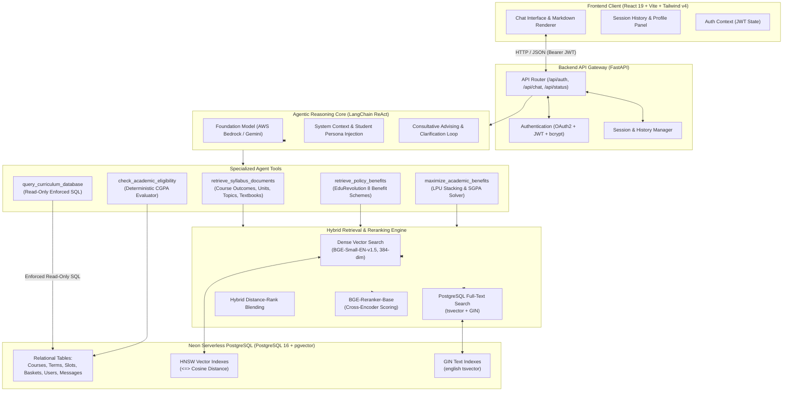

<div align="center">

# 🧭 CourseCompass
### Autonomous AI Academic Advisor & Curriculum Personalization Engine

[](https://fastapi.tiangolo.com)
[](https://python.org)
[](https://neon.tech)
[](https://github.com/pgvector/pgvector)
[](https://www.langchain.com)
[](https://react.dev)
[](https://vitejs.dev)
[](https://tailwindcss.com)

**CourseCompass** is an intelligent, multi-tool AI Academic Advisor and Retrieval-Augmented Generation (RAG) platform designed to eliminate academic fragmentation for university students (instantiated for Lovely Professional University — B.Tech Computer Science & Engineering).

[Quick Start](#-quick-start-in-5-minutes) • [Architecture](#-system-architecture) • [Key Capabilities](#-key-capabilities) • [Documentation Hub](#-documentation-hub) • [API Reference](docs/API_REFERENCE.md)

</div>

---

## 📌 The Problem & The Solution

### The Challenge
University academic information is typically scattered across dozens of disconnected documents and portals:
- **Curriculum & Electives**: Complex semester charts with discipline-specific courses, department electives, and open minors.
- **Course Documents**: High-level **Syllabus** outlines are stored separately from operational **Instruction Plans (IP)** containing exact marks breakdowns, Continuous Assessment (CA) rubrics, and lecture schedules.
- **Academic Benefits Policies**: Revolutionary policies like LPU's **EduRevolution** (rewarding internships, hackathon podiums, research papers, patents, and freelancing revenue with grade jumps, attendance relaxations, and CA waivers) are buried in multi-page matrices that students struggle to interpret.

### The CourseCompass Solution
CourseCompass bridges these worlds by combining:
1. **Relational Curriculum Database**: Exact PostgreSQL tables on **Neon** storing terms, courses, credits, baskets, and slot schedules.
2. **Hybrid Retrieval (Dense + Lexical)**: HNSW vector similarity search (`pgvector` with `BAAI/bge-small-en-v1.5`) blended with PostgreSQL Full-Text Search (`tsvector`/GIN) and cross-encoder reranking (`BAAI/bge-reranker-base`).
3. **Agentic Reasoning Loop**: A LangChain ReAct agent equipped with 5 specialized tools, read-only SQL transaction isolation, and student profile context injection.
4. **Consultative Cross-Examination Protocol**: Instead of hallucinating answers or dumping 40-row policy matrices when inquiries lack detail, the agent actively questions the student to gather exact facts before prescribing a benefit.
5. **Modern Editorial UI**: A responsive, accessible React 19 interface with real-time markdown rendering, collapsible source citations, and persistent session management.

---

## 🏗 System Architecture



---

## ✨ Key Capabilities

| Capability | Technical Implementation | Benefit to Student |
| :--- | :--- | :--- |
| **Dual Document Disambiguation** | Separate document categorization for `Syllabus` (topics, COs, labs) vs. `IP` (marks weightages, CA/MTE scheme, weekly plan). | Students get exact exam weightages from their Instruction Plan without confusing it with general syllabus text. |
| **EduRevolution Benefit Calculator** | Semantic search across the 8 EduRevolution schemes (10% Attendance, Duty Leave, Grade Upgradation, Internships, MOOCs, RPL, SCRGM). | Instantly determines whether an internship, hackathon podium, Scopus paper, or certification earns CA waivers or grade jumps. |
| **Benefit Stacking & SGPA Maximizer** | Multi-achievement optimization algorithm adhering to LPU constraints (1 benefit/course, high-credit course prioritization, university-wide attendance stacking). | Helps students holding multiple accomplishments maximize their final semester SGPA. |
| **Consultative Advising Protocol** | Dynamic multi-turn cross-examination questions when user inputs are underspecified. | Eliminates hallucinations and prevents overwhelming 30-row policy dumps. |
| **Exact Curriculum Querying** | Read-only SQL execution (`SET TRANSACTION READ ONLY`) on relational tables. | Accurate answers to structural questions like elective basket options and prerequisite trees. |
| **Personalized Advising Context** | Student academic profile (Registration number, Program, Term, CGPA) injected directly into agent context. | Proactively checks the student's actual CGPA against mandatory policy thresholds. |
| **Persistent Chat Sessions** | Relational session storage in PostgreSQL with automatic title generation and history recall. | Seamless multi-turn conversations accessible across devices and page reloads. |

---

## 🚀 Quick Start in 5 Minutes

> [!TIP]
> CourseCompass uses a cloud-hosted **Neon PostgreSQL** database with `pgvector` pre-configured. **No local Docker setup is required!**

### Step 1: Clone the Repository
```bash
git clone https://github.com/Tanishquppal220/CourseCompas.git CourseCompass
cd CourseCompass
```

### Step 2: Configure Environment Variables
```bash
cd backend
cp .env.example .env
```
Update `backend/.env` with your Neon database URL and credentials:
```env
DATABASE_URL="postgresql://neondb_owner:<password>@<neon-host>.neon.tech/coursecompass?sslmode=require"
AWS_ACCESS_KEY_ID="your-aws-key"
AWS_SECRET_ACCESS_KEY="your-aws-secret"
AWS_REGION="us-east-1"
```

### Step 3: Install Dependencies & Initialize Database
Using **[uv](https://docs.astral.sh/uv/)** (recommended) or `pip`:
```bash
# 1. Install dependencies
uv sync

# 2. Seed relational curriculum (Terms 1-8, 250+ courses, elective baskets)
uv run python scripts/seed.py

# 3. Ingest and embed course documents & academic benefits into Neon
uv run python scripts/ingest.py --workers 4

# 4. Generate Full-Text Search (FTS) columns & GIN indexes
uv run python scripts/add_fts.py
```

### Step 4: Start the Backend Server
```bash
uv run uvicorn app.main:app --reload --host 0.0.0.0 --port 8000
```
- API is running at: `http://localhost:8000`
- Interactive API Docs: `http://localhost:8000/docs`

### Step 5: Start the Frontend Application
Open a new terminal window:
```bash
cd frontend
npm install
npm run dev
```
- Frontend UI is running at: `http://localhost:5173`

---

## 📂 Repository Structure

```text
CourseCompass/
├── backend/                         # FastAPI Python Backend Microservice
│   ├── app/
│   │   ├── main.py                  # API routes, CORS, session endpoints
│   │   ├── auth.py                  # JWT authentication, bcrypt hashing
│   │   ├── models.py                # SQLAlchemy relational & pgvector models
│   │   ├── database.py              # Engine connection & session factory
│   │   ├── llm.py                   # LLM provider configuration & agent persona
│   │   ├── agent.py                 # LangChain ReAct agent loop & tool implementations
│   │   ├── embeddings.py            # BGE-Small-EN-v1.5 dense vector embedder
│   │   ├── reranker.py              # BGE-Reranker-Base cross-encoder
│   │   └── retrieval.py             # Hybrid search (dense vector + FTS tsvector)
│   ├── data/
│   │   ├── Syllabus/                # 36+ Course Syllabus PDF documents
│   │   ├── IP/                      # 39+ Course Instruction Plan (IP) PDF documents
│   │   ├── Schema.md                # Full academic program structure markdown
│   │   └── benefits_clean.md        # Cleaned EduRevolution benefits policy markdown
│   ├── scripts/
│   │   ├── seed.py                  # Relational curriculum database seeder
│   │   ├── ingest.py                # PDF parser, chunker, & vector ingestion pipeline
│   │   ├── chunkers.py              # Domain-specific chunkers (Syllabus, IP, Benefits)
│   │   ├── cleaners.py              # Text cleaning & boilerplate removal
│   │   ├── parse_pdf.py             # PDF layout extractor (PyMuPDF / Docling)
│   │   └── add_fts.py               # Generates tsvector columns and GIN indexes
│   ├── pyproject.toml               # Python package configuration
│   └── .env.example                 # Environment variables template
├── frontend/                        # React 19 + TypeScript + Vite Frontend SPA
│   ├── src/
│   │   ├── components/              # Chat window, sidebar, headers, input boxes
│   │   ├── lib/                     # Auth context, API helpers, styling utils
│   │   ├── pages/                   # Login, Register, Profile views
│   │   ├── App.tsx                  # Master routing configuration
│   │   └── index.css                # Tailwind v4 styles & design tokens
│   ├── package.json                 # Node dependencies
│   └── vite.config.ts               # Vite bundler & API proxy configuration
├── docs/                            # Comprehensive Project Documentation
│   ├── SETUP_GUIDE.md               # End-to-end setup & troubleshooting manual
│   ├── ARCHITECTURE.md              # Technical architecture & pipeline blueprint
│   ├── DATABASE_SCHEMA.md           # Database tables, models, indexes, and ERD
│   ├── API_REFERENCE.md             # REST API specifications and curl examples
│   ├── BENEFITS_AND_POLICIES.md     # LPU EduRevolution framework & benefit rules
│   ├── dbml.md                      # DBML database representation
│   └── walk.md                      # Relational migration walkthrough
├── Tracker.md                       # Project progress log & architectural decisions
└── README.md                        # Master Project Documentation (This file)
```

---

## 📖 Documentation Hub

For detailed deep dives, consult the specialized guides in the `docs/` folder:

| Document | Description |
| :--- | :--- |
| **[Setup & Installation Guide](docs/SETUP_GUIDE.md)** | Step-by-step setup guide with copy-paste commands, Neon connection details, and solutions to common errors. |
| **[System Architecture & Design](docs/ARCHITECTURE.md)** | Comprehensive blueprint covering the ReAct agent, hybrid retrieval mathematics, consultative advising protocols, and PDF chunkers. |
| **[Database Schema & Models](docs/DATABASE_SCHEMA.md)** | Complete Entity-Relationship Diagram (ERD), table definitions, HNSW vector indexing parameters, and sample SQL queries. |
| **[REST API Reference](docs/API_REFERENCE.md)** | Full OpenAPI documentation with request/response schemas, JWT authentication headers, and `curl` code snippets. |
| **[Academic Benefits & Policies](docs/BENEFITS_AND_POLICIES.md)** | Domain guide detailing LPU's 8 EduRevolution schemes, the internship matrix, grade jumps, and UMS nomination workflows. |
| **[Backend Service README](backend/README.md)** | Developer documentation for the FastAPI microservice, CLI flags, and ingestion pipelines. |
| **[Frontend App README](frontend/README.md)** | Developer documentation for the React 19 single-page application and UI components. |

---

## 🧪 Sample Queries to Try

Once CourseCompass is running, test these realistic academic queries:

1. **Instruction Plan & Assessment Weightages**:
   > *"What is the continuous assessment (CA) and mid-term exam (MTE) marks distribution for CSE205?"*
2. **Syllabus & Course Topics**:
   > *"What topics are covered in Unit 3 of Python Programming (INT108), and what are the prescribed textbooks?"*
3. **Internship Benefit Evaluation (Consultative Protocol)**:
   > *"I did an internship. Am I eligible for any academic benefit?"*  
   *(Notice how the advisor politely asks clarifying questions regarding duration, stipend, and company tier before computing your benefit).*
4. **Benefit Stacking & Maximization**:
   > *"I have a 3-month startup internship at ₹12,000/month, a Scopus Q1 paper, and a 7.9 CGPA. How should I stack these benefits across my Term 5 courses?"*
5. **Attendance Relaxation**:
   > *"What are the requirements to get the 10% Attendance Benefit for competitive exams?"*
6. **Curriculum & Elective Options**:
   > *"What department electives are offered in Term 5 for the Artificial Intelligence area?"*

---

## 🛠 Technology Stack

- **Backend**: Python 3.13, FastAPI, SQLAlchemy 2.0, Pydantic v2, PyMuPDF, Docling, UV
- **Agent & AI**: LangChain 1.3, LangGraph, AWS Bedrock Converse (`openai.gpt-oss-120b-1:0`), Google Gemini
- **Embeddings & Reranker**: `BAAI/bge-small-en-v1.5` (384-dim dense vectors), `BAAI/bge-reranker-base` (Cross-Encoder)
- **Database**: Neon Serverless PostgreSQL 16, `pgvector` (HNSW indexing), PostgreSQL Full-Text Search (`tsvector`, GIN)
- **Frontend**: React 19, TypeScript, Vite, Tailwind CSS v4, `@base-ui/react`, `lucide-react`, `react-markdown`

---

## 📄 License & Attribution

Developed for academic advising at **Lovely Professional University (LPU)**.  
Course data, instruction plans, and benefit rules are sourced from official university publications.
