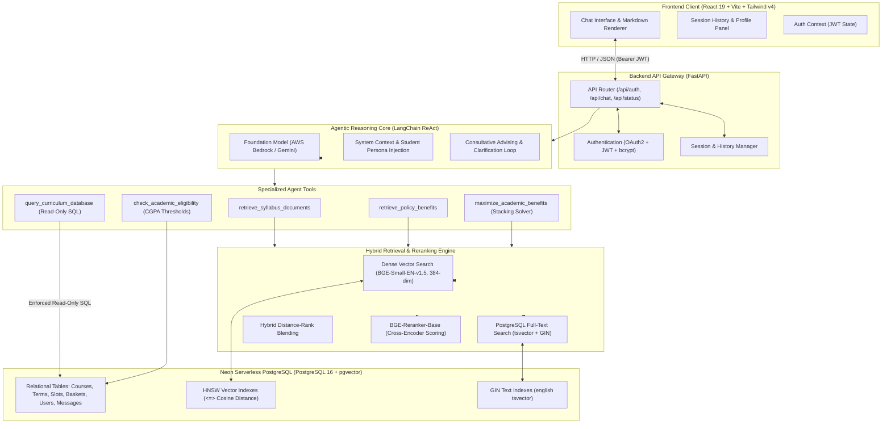
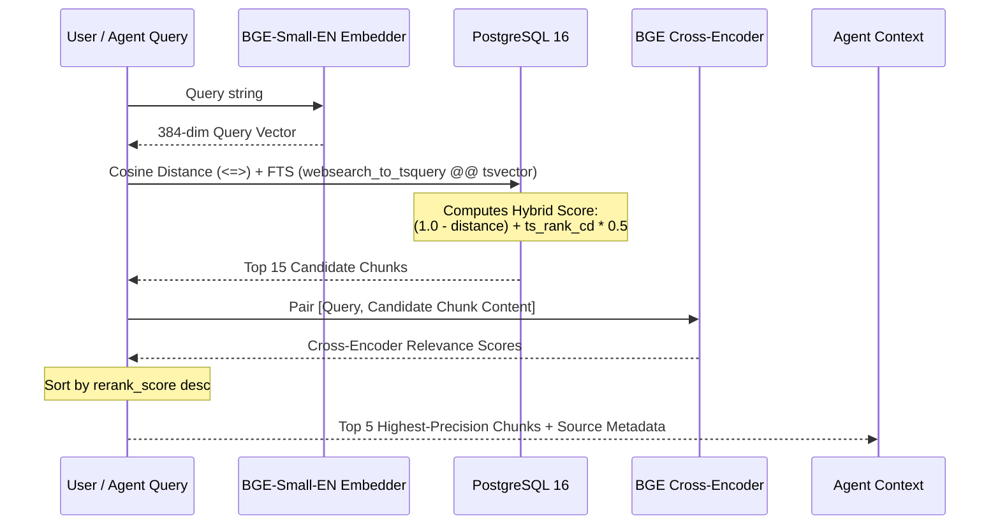

# CourseCompass — System Architecture & Design

CourseCompass is an enterprise-grade, agentic AI Academic Advisor and Retrieval-Augmented Generation (RAG) system built specifically for university students, programs, and regulations (instantiated for Lovely Professional University - B.Tech CSE).

This document outlines the end-to-end technical architecture, component responsibilities, data flow, hybrid retrieval algorithms, and agentic reasoning loops.

---

## 1. High-Level System Architecture



---

## 2. Frontend Client Architecture

The frontend is a single-page application built with modern React standards:

- **Framework**: **React 19** with **TypeScript** and **Vite 8**.
- **Styling**: **Tailwind CSS v4** with a custom editorial design system (warm cream canvas `#faf9f5`, coral brand accent `#cc785c`, deep ink typography, and dark surface cards).
- **Component Primitives**: `@base-ui/react` and `shadcn/ui` components for accessible modals, dropdowns, buttons, and scroll areas.
- **Routing**: `react-router-dom` v7 handling routes:
  - `/`: New anonymous or authenticated chat session.
  - `/chat/:id`: Persistent multi-turn conversation session.
  - `/login` and `/register`: Student authentication.
  - `/profile`: Academic status overview (Registration number, Program, Term, CGPA).
- **Rich Rendering**:
  - `react-markdown` with `remark-gfm` (tables, strikethrough, checklists).
  - `rehype-highlight` for syntax-highlighted code snippets.
  - Collapsible source citations accordion listing exact document titles, page numbers, and sections.
- **State Management**:
  - `AuthContext`: Centralized JWT token persistence in `localStorage`, automatic decoding of user session, and auth header injection.
  - `MessageScroller`: Smooth auto-scrolling container with intelligent scroll anchoring during generation.

---

## 3. Backend Architecture & API Gateway

The backend service is structured with **FastAPI**:

```text
backend/app/
├── main.py          # FastAPI application, route declarations, and CORS configuration
├── auth.py          # JWT generation/decoding, bcrypt password hashing, and user dependencies
├── models.py        # SQLAlchemy ORM models (Relational schema, pgvector tables, FTS columns)
├── database.py      # SQLAlchemy connection engine, connection pool recycling, and SessionLocal
├── llm.py           # LLM provider initialization (AWS Bedrock Converse / Gemini) and persona
├── agent.py         # LangChain ReAct agent loop, tool definitions, and citation extraction
├── embeddings.py    # BAAI/bge-small-en-v1.5 embedding pipeline (384 dimensions)
├── reranker.py      # BAAI/bge-reranker-base cross-encoder reranking
└── retrieval.py     # Hybrid search query builder (cosine distance + ts_rank_cd)
```

### Key API Gateway Features:
1. **Stateless JWT Authentication**: Passwords hashed using `bcrypt` (with automatic 72-byte truncation safety). Tokens signed with HMAC-SHA256 (`HS256`) with a 7-day expiration.
2. **Dual-Mode Chat**:
   - **Guest Mode**: Unauthenticated users can immediately chat and ask questions without creating an account.
   - **Authenticated Mode**: Automatically links conversation turns to a persistent `chat_sessions` UUID and records every turn in `chat_messages`.
3. **Student Profile Context Injection**: When an authenticated student chats, their profile (Registration Number, Program, Current Term, CGPA) is dynamically injected into the LLM system prompt so all advice is personalized.

---

## 4. The Agentic Reasoning Engine

Unlike naive RAG systems that pass a single query directly to a vector store, CourseCompass uses a **ReAct (Reason + Act)** agent loop orchestrated with LangChain:

### 4.1 System Persona & Grounding Rules
Configured in `app/llm.py` and `app/agent.py`:
- **Identity**: CourseCompass, dedicated AI Academic Advisor for Lovely Professional University.
- **Institutional Guardrails**:
  - Recognizes university-specific terminology (`IP` strictly means **Instruction Plan**, never IP address; `CA` = Continuous Assessment; `MTE` = Mid-Term Exam; `ETE` = End-Term Exam).
  - Enforces relative grading rules and the 75% attendance threshold (with Week-1 double attendance incentive).
  - Never quotes fixed calendar dates (directs students to live UMS notifications).
  - Directs physical escalations to **Block 38 - Room 205B** and RMS ticket category `Edu-Revolution : Be the change`.

### 4.2 The 5 Specialized Tools

#### Tool 1: `retrieve_syllabus_documents`
- **Purpose**: Retrieves course-specific content from two distinct document types:
  - `Syllabus`: Topics by unit, course outcomes (COs), textbooks, reference books, lab practicals.
  - `IP` (Instruction Plan): Exact marks distribution (ATT, CA, MTE, ETE weightages), week-by-week lecture breakdown, and evaluation schemes.
- **Filters**: Supports filtering by `course_code` (e.g., `CSE205`) and `doc_type` (`Syllabus` or `IP`).

#### Tool 2: `retrieve_policy_benefits`
- **Purpose**: Semantic and keyword retrieval across the 8 EduRevolution policy schemes (10% Attendance Benefit, Duty Leave, Grade Upgradation, Internship Beyond Curriculum, NPTEL Equivalence, Project-based benefits, RPL, SCRGM).

#### Tool 3: `query_curriculum_database`
- **Purpose**: Allows the agent to answer exact structural curriculum questions (e.g., *"What electives can I take in Term 5?"*, *"List all 4-credit courses in the program"*).
- **Security**: Enforces strict read-only execution:
  - Executes `SET TRANSACTION READ ONLY;` at the session level.
  - Regex guards enforce query must start with `SELECT` or `WITH`.
  - Rejects any query containing mutation keywords (`INSERT`, `UPDATE`, `DELETE`, `DROP`, `ALTER`, `GRANT`, `TRUNCATE`).

#### Tool 4: `maximize_academic_benefits`
- **Purpose**: Solves the multi-achievement benefit allocation problem.
- **Constraints Applied**:
  - Exactly **ONE** mapped academic benefit per course per semester.
  - High-credit courses (3 or 4 credits) are prioritized for Grade Upgradation or CA/MTE waivers to maximize SGPA impact.
  - 10% Attendance Benefit is university-wide: stacks across *all* courses simultaneously if student's CGPA $\ge 7.5$ and raw attendance $\ge 60\%$.

#### Tool 5: `check_academic_eligibility`
- **Purpose**: Instant deterministic rule evaluation:
  - Attendance Benefit: CGPA $\ge 7.5$.
  - Internship Course Mapping: CGPA $\ge 6.0$.
  - Research Papers / Patents: No minimum CGPA required.

---

## 5. Consultative Advising & Cross-Examination Protocol

A critical design innovation in CourseCompass is the **Consultative Cross-Examination Protocol**.

### The Problem:
When students ask questions like:
- *"I got an internship, how many marks will I get?"*
- *"Can my AWS certificate waive my cloud course?"*
- *"I won a hackathon, can I get full marks?"*

A naive RAG bot will either guess missing details, hallucinate criteria, or dump a 40-row policy table that overwhelms the user.

### The CourseCompass Solution:
The agent acts like an experienced university dean:
1. **Acknowledges and validates** the accomplishment.
2. **Identifies the applicable policy pathway** (e.g., *Internship beyond Curriculum under EduRevolution*).
3. **Cross-examines the student with 2–4 numbered clarifying questions**:
   - **For Internships**: Exact duration (1-2 months, 3 months, 4 months, 5-6 months)? Monthly stipend (<5k, 5k-10k, 10k-20k, >25k)? Company tier (Startup, State/National Agency, Premier Corporate)?
   - **For Certifications**: Platform (NPTEL, AWS, Oracle)? Was the final exam center-proctored? Which specific LPU course code?
   - **For Hackathons**: Host tier (Tier-I: IIT/NIT/Govt, Tier-II: NIRF University, Tier-III: College)? Standing (1st, 2nd/3rd, or participation)?
4. Once the student replies in the next turn, the agent computes the exact waiver and gives the 4-step UMS submission procedure.

---

## 6. The Hybrid Retrieval Pipeline

CourseCompass uses a hybrid retrieval pipeline that blends semantic embeddings, PostgreSQL Full-Text Search, and a Cross-Encoder reranker:



### 6.1 Dense Semantic Search
- **Model**: `BAAI/bge-small-en-v1.5`
- **Dimensions**: 384
- **Vector Index**: HNSW index in PostgreSQL with `vector_cosine_ops`:
  ```sql
  CREATE INDEX ix_course_doc_chunks_embedding 
  ON course_doc_chunks USING hnsw (embedding vector_cosine_ops);
  ```

### 6.2 Lexical Full-Text Search (FTS)
- **Engine**: Native PostgreSQL `tsvector` with English dictionary.
- **Generated Column & GIN Index**:
  ```sql
  ALTER TABLE course_doc_chunks 
  ADD COLUMN fts tsvector 
  GENERATED ALWAYS AS (to_tsvector('english', coalesce(section_title, '') || ' ' || coalesce(content, ''))) STORED;

  CREATE INDEX ix_course_doc_chunks_fts ON course_doc_chunks USING GIN (fts);
  ```

### 6.3 Hybrid Scoring Formula
To balance keyword precision (course codes, specific terminology) and semantic context:
$$\text{Score} = (1.0 - \text{CosineDistance}) + 0.5 \times \text{ts\_rank\_cd}(\text{fts}, \text{query})$$

Only chunks satisfying either $(\text{CosineDistance} < 0.6)$ or $(\text{fts @@ tsquery})$ are retained as candidates, preventing irrelevant filler chunks.

### 6.4 Cross-Encoder Reranking
- **Model**: `BAAI/bge-reranker-base`
- Passes `[query, chunk_content]` through a cross-encoder model to evaluate deep semantic interaction before returning the final top-$k$ (default 5) documents to the agent.

---

## 7. Document Ingestion & Parsing Subsystem

Located in `backend/scripts/`:
- `parse_pdf.py`: PDF layout extraction supporting both **PyMuPDF** (`pymupdf4llm` with layout analysis) and **Docling**. Supports process caching in `.cache/` to ensure lightning-fast repeat runs.
- `chunkers.py`: Domain-specific chunking logic:
  - `chunk_syllabus`: Parses course overview, units, topics, course outcomes (`CO1`..`CO6`), textbooks, reference books, and lab practicals.
  - `chunk_ip`: Parses complex 20+ page instruction plan tables into per-lecture units with associated pedagogical tools, outcomes, and reading references.
  - `chunk_benefits`: Chunks the EduRevolution policy document into distinct policy overviews, criteria matrix rows, and submission rules.
- `cleaners.py`: Strips repetitive university headers, footers, tentative plan disclaimers, and boilerplate text.
- `ingest.py`: End-to-end ingestion orchestrator with multi-process worker pool (`--workers N`), incremental change detection, and batch vectorization.
- `seed.py`: Relational curriculum seeding for all 8 terms, 250+ courses, elective areas, and basket options.
- `add_fts.py`: Migration script applying the stored `tsvector` generated columns and GIN indexes.
