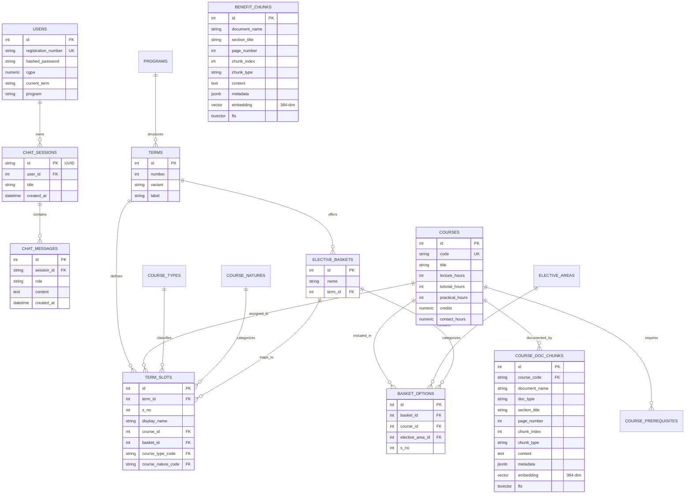

# CourseCompass — Database Schema & Data Models

CourseCompass utilizes **Neon Serverless PostgreSQL (PostgreSQL 16)** with the **`pgvector`** extension to store two complementary types of data:
1. **Relational Data**: Highly structured academic records (programs, terms, courses, prerequisites, elective baskets, term slots, users, chat sessions, and messages).
2. **Unstructured / Vector & FTS Data**: Semantic text chunks with 384-dimensional dense vector embeddings and stored PostgreSQL `tsvector` columns for hybrid search.

---

## 1. Entity-Relationship Diagram (ERD)



---

## 2. Relational Tables Specification

### 2.1 User & Session Management

#### `users`
Stores student accounts and academic profiles.
| Column | Type | Constraints | Description |
| :--- | :--- | :--- | :--- |
| `id` | `INTEGER` | `PRIMARY KEY`, `AUTOINCREMENT` | Unique user identifier |
| `registration_number` | `VARCHAR(50)` | `UNIQUE`, `NOT NULL`, `INDEX` | Student registration number (e.g., `12200001`) |
| `hashed_password` | `VARCHAR(255)` | `NOT NULL` | `bcrypt`-hashed password |
| `cgpa` | `NUMERIC(4,2)` | `NULLABLE` | Student's current cumulative grade point average (e.g., `7.85`) |
| `current_term` | `VARCHAR(50)` | `NULLABLE` | Current semester/term (e.g., `Term 5`) |
| `program` | `VARCHAR(150)` | `NULLABLE` | Degree program name (e.g., `B.Tech Computer Science and Engineering`) |

#### `chat_sessions`
Stores conversation sessions.
| Column | Type | Constraints | Description |
| :--- | :--- | :--- | :--- |
| `id` | `VARCHAR(36)` | `PRIMARY KEY` | Session UUID |
| `user_id` | `INTEGER` | `FOREIGN KEY(users.id)`, `NOT NULL` | Owning student |
| `title` | `VARCHAR(255)` | `NOT NULL` | Generated session title summary |
| `created_at` | `TIMESTAMP` | `DEFAULT now()` | Creation timestamp |

#### `chat_messages`
Stores individual conversation turns within a session.
| Column | Type | Constraints | Description |
| :--- | :--- | :--- | :--- |
| `id` | `INTEGER` | `PRIMARY KEY`, `AUTOINCREMENT` | Message identifier |
| `session_id` | `VARCHAR(36)` | `FOREIGN KEY(chat_sessions.id)`, `NOT NULL` | Session UUID |
| `role` | `VARCHAR(50)` | `NOT NULL` | Message author (`user` or `assistant`) |
| `content` | `TEXT` | `NOT NULL` | Full text / markdown content |
| `created_at` | `TIMESTAMP` | `DEFAULT now()` | Message timestamp |

---

### 2.2 Academic Curriculum Schema

#### `courses`
Stores all approved university courses.
| Column | Type | Constraints | Description |
| :--- | :--- | :--- | :--- |
| `id` | `INTEGER` | `PRIMARY KEY` | Internal ID |
| `code` | `VARCHAR(20)` | `UNIQUE`, `NOT NULL`, `INDEX` | Official course code (e.g., `CSE205`, `INT108`) |
| `title` | `VARCHAR(200)` | `NOT NULL` | Full course title |
| `lecture_hours` | `INTEGER` | `NOT NULL`, `DEFAULT 0` | Weekly lecture hours (L) |
| `tutorial_hours`| `INTEGER` | `NOT NULL`, `DEFAULT 0` | Weekly tutorial hours (T) |
| `practical_hours`| `INTEGER`| `NOT NULL`, `DEFAULT 0` | Weekly practical / lab hours (P) |
| `credits` | `NUMERIC(4,1)` | `NOT NULL` | Academic credits (e.g., `4.0`) |
| `contact_hours` | `NUMERIC(4,1)` | `NOT NULL` | Weekly contact hours (e.g., `5.0`) |

#### `terms`
Academic semesters/terms within the program.
| Column | Type | Constraints | Description |
| :--- | :--- | :--- | :--- |
| `id` | `INTEGER` | `PRIMARY KEY` | Term ID |
| `number` | `INTEGER` | `NOT NULL` | Term number (1 through 8) |
| `variant` | `VARCHAR(30)` | `NULLABLE` | Pathway variant (e.g., `Regular`, `Internship`) |
| `label` | `VARCHAR(100)`| `NOT NULL` | Human-readable label (e.g., `Term 5 (Regular)`) |

*Constraints:* `UNIQUE(number, variant)`

#### `course_types` & `course_natures`
Lookup tables categorizing course pedagogical purposes and credit distributions:
- **`course_types`**:
  - `CR`: Core Course
  - `CE`: Core Elective
  - `DE`: Departmental Elective
  - `EM`: Engineering Minor
  - `OM`: Open / Minor
  - `PE`: Pathway Elective
  - `TE`: Training Elective
  - `APE`: Aptitude Elective
- **`course_natures`**:
  - `DSC`: Discipline Core
  - `ESC`: Engineering Science
  - `BSC`: Basic Science
  - `LCS`: Language & Communication Skills
  - `OEM`: Open Minor / Open Elective
  - `PRJ`: Project (Capstone, Research)
  - `TCF`: Training Compulsory - Full Term
  - `TCS`: Training Compulsory - Summer

#### `elective_baskets` & `basket_options`
Manages elective groups from which students select courses:
- **`elective_baskets`**: Defines basket name and associated term (e.g., `Department Elective 1`).
- **`basket_options`**: Links a basket to allowed `courses` and an optional `elective_areas` focus (e.g., *Artificial Intelligence*, *Cybersecurity*, *Cloud Computing*).

#### `term_slots`
The scheduled curriculum layout mapping slots in each term to either a fixed course or an elective basket.
| Column | Type | Description |
| :--- | :--- | :--- |
| `id` | `INTEGER` (PK) | Slot ID |
| `term_id` | `INTEGER` (FK) | Target term |
| `s_no` | `INTEGER` | Serial ordering in term schedule |
| `display_name` | `VARCHAR(150)` | Label (e.g., `CORE ELECTIVE 1` or course title) |
| `course_id` | `INTEGER` (FK, Nullable) | Fixed course if non-elective |
| `basket_id` | `INTEGER` (FK, Nullable) | Elective basket if slot is an elective |
| `course_type_code` | `VARCHAR(8)` (FK) | Reference to `course_types` |
| `course_nature_code`| `VARCHAR(8)` (FK) | Reference to `course_natures` |

---

## 3. Vector & Full-Text Search Tables

### 3.1 `course_doc_chunks`
Stores semantic chunks from course **Syllabus** and **Instruction Plan (IP)** PDF documents.

| Column | Type | Indexing | Description |
| :--- | :--- | :--- | :--- |
| `id` | `INTEGER` | `PRIMARY KEY`, `AUTOINCREMENT` | Chunk ID |
| `course_code` | `VARCHAR(20)` | `INDEX`, `FK(courses.code)` | Target course (e.g., `CSE205`) |
| `document_name`| `VARCHAR(255)` | — | Source PDF file name (e.g., `CSE205.pdf`) |
| `doc_type` | `VARCHAR(20)` | `INDEX` | `Syllabus` or `IP` |
| `section_title`| `VARCHAR(255)` | — | Section or topic heading |
| `page_number` | `INTEGER` | — | Page in original document |
| `chunk_index` | `INTEGER` | — | Sequential index within document |
| `chunk_type` | `VARCHAR(50)` | — | `unit`, `lecture`, `practical`, `course_outcome`, `table_row` |
| `content` | `TEXT` | — | Cleaned textual content |
| `metadata` | `JSONB` | — | Additional parsed attributes (e.g., L/T/P, textbooks) |
| `embedding` | `vector(384)` | **HNSW** (`vector_cosine_ops`) | 384-dim dense vector (`BAAI/bge-small-en-v1.5`) |
| `fts` | `tsvector` | **GIN** (`ix_course_doc_chunks_fts`) | Stored TSVector for English lexical search |

### 3.2 `benefit_chunks`
Stores policy text and tabular criteria rows from the **Academic Benefits (EduRevolution)** document.

| Column | Type | Indexing | Description |
| :--- | :--- | :--- | :--- |
| `id` | `INTEGER` | `PRIMARY KEY`, `AUTOINCREMENT` | Chunk ID |
| `document_name`| `VARCHAR(255)` | — | Source document (`Academic Benefits.pdf`) |
| `section_title`| `VARCHAR(255)` | — | Scheme title (e.g., `Grade Upgradation`, `Duty Leave`) |
| `page_number` | `INTEGER` | — | Page number |
| `chunk_index` | `INTEGER` | — | Sequential index |
| `chunk_type` | `VARCHAR(50)` | — | `policy_overview`, `criteria_row`, `special_note` |
| `content` | `TEXT` | — | Eligibility conditions, proofs required, and benefit formulas |
| `metadata` | `JSONB` | — | Category, stage, or stipend range metadata |
| `embedding` | `vector(384)` | **HNSW** (`vector_cosine_ops`) | 384-dim dense vector (`BAAI/bge-small-en-v1.5`) |
| `fts` | `tsvector` | **GIN** (`ix_benefit_chunks_fts`) | Stored TSVector for English lexical search |

---

## 4. Indexing & Optimization Strategy

### 4.1 Vector Indexing (HNSW)
CourseCompass utilizes Hierarchical Navigable Small World (HNSW) graphs in PostgreSQL:
```sql
CREATE INDEX IF NOT EXISTS ix_course_doc_chunks_embedding 
ON course_doc_chunks USING hnsw (embedding vector_cosine_ops);

CREATE INDEX IF NOT EXISTS ix_benefit_chunks_embedding 
ON benefit_chunks USING hnsw (embedding vector_cosine_ops);
```
- **Operator**: `vector_cosine_ops` matches cosine distance `<=>`.
- **Query performance**: Sub-10ms similarity queries across tens of thousands of chunks without scanning the whole table.

### 4.2 Full-Text Search (FTS) Indexing
Lexical keyword matching uses PostgreSQL GIN indexes on automatically generated `tsvector` columns:
```sql
ALTER TABLE course_doc_chunks 
ADD COLUMN IF NOT EXISTS fts tsvector 
GENERATED ALWAYS AS (to_tsvector('english', coalesce(section_title, '') || ' ' || coalesce(content, ''))) STORED;

CREATE INDEX IF NOT EXISTS ix_course_doc_chunks_fts ON course_doc_chunks USING GIN (fts);
```

---

## 5. Sample Useful Queries

### Check Term 5 Curriculum & Course Titles
```sql
SELECT ts.s_no, c.code, c.title, c.credits, ct.description AS type
FROM term_slots ts
JOIN terms t ON t.id = ts.term_id
LEFT JOIN courses c ON c.id = ts.course_id
LEFT JOIN course_types ct ON ct.code = ts.course_type_code
WHERE t.number = 5
ORDER BY ts.s_no;
```

### Hybrid Vector Search for a Specific Course
```sql
SELECT 
    id, 
    doc_type, 
    section_title, 
    (1.0 - (embedding <=> :query_vector)) + 
    COALESCE(ts_rank_cd(fts, websearch_to_tsquery('english', 'binary search trees')), 0.0) * 0.5 AS score,
    content
FROM course_doc_chunks
WHERE course_code = 'CSE205'
ORDER BY score DESC
LIMIT 5;
```

### Find All Electives in an Area (e.g., AI/ML)
```sql
SELECT c.code, c.title, c.credits, eb.name AS basket_name
FROM basket_options bo
JOIN courses c ON c.id = bo.course_id
JOIN elective_baskets eb ON eb.id = bo.basket_id
JOIN elective_areas ea ON ea.id = bo.elective_area_id
WHERE ea.name ILIKE '%Machine Learning%' OR ea.name ILIKE '%Artificial Intelligence%';
```
